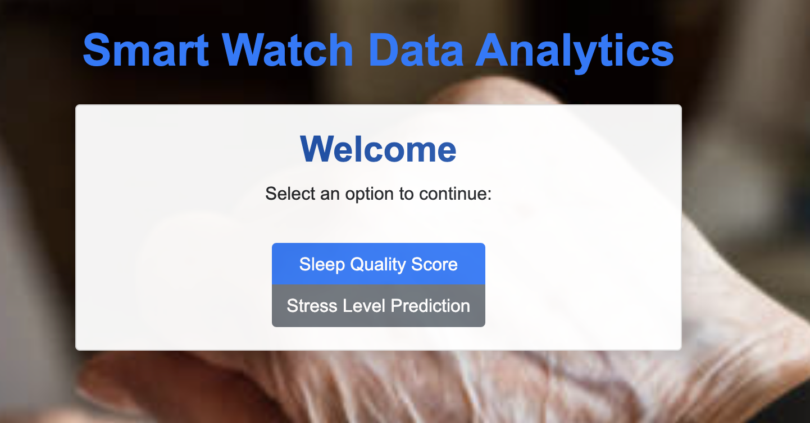
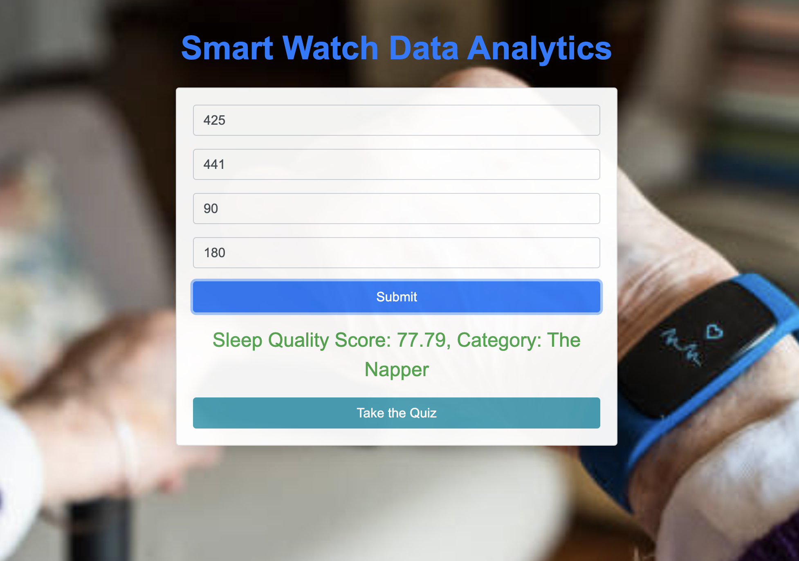
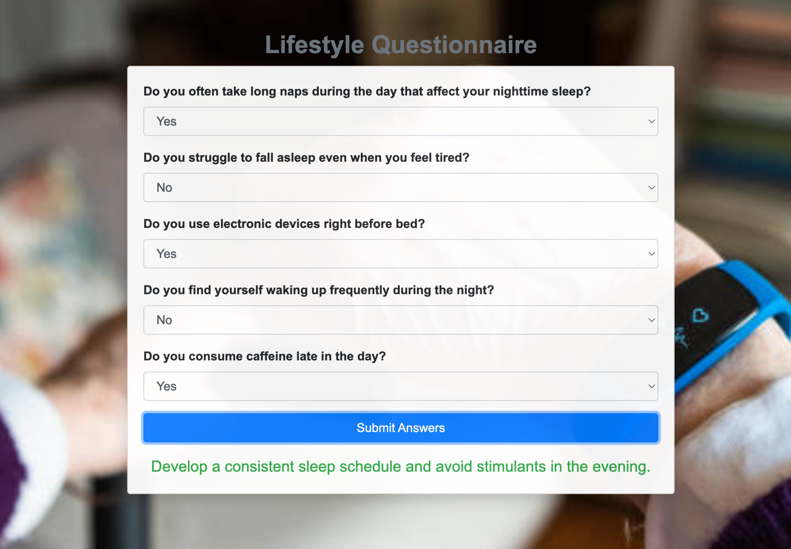
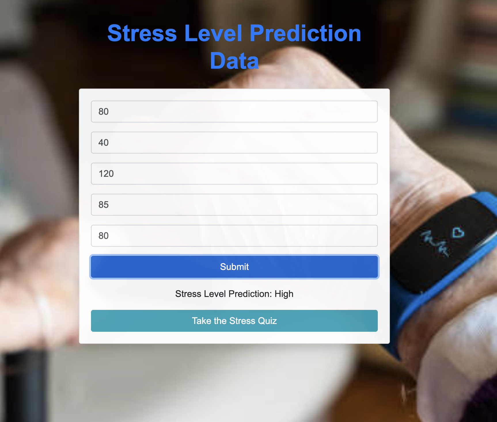
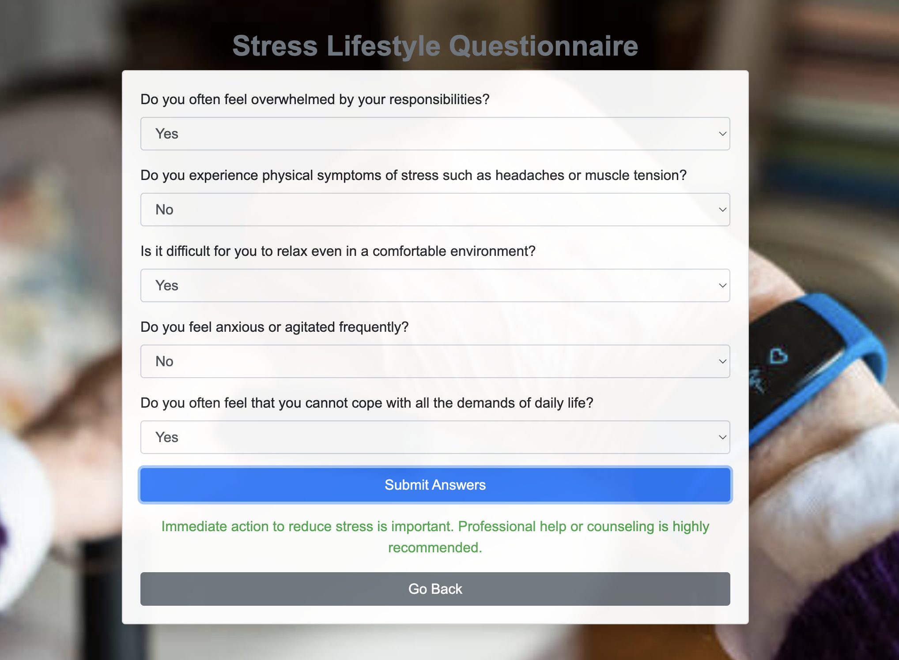

# Smart Watch Data Analytics

## Overview
Smart Watch Data Analytics is an application designed to predict sleep quality and stress levels based on data collected from smartwatches. Utilizing advanced machine learning techniques, the application provides valuable insights into user's sleep patterns and stress factors, enabling them to make informed decisions about their health and wellness.

## Implementation
The core of the application revolves around two predictive models: one for sleep quality assessment and another for stress level prediction. These models were developed using Python and are serialized in the `.joblib` format. The `Sleep_Score_Prediction.ipynb` and `Stress_Prediction.ipynb` Jupyter notebooks contain the model development process, including data preprocessing, feature engineering, model selection, and evaluation. Key findings from the model development are highlighted within these notebooks.

The application is structured into several key directories:
- `app/`: Contains the Flask application along with the routes, utilities, and configuration files.
- `models/`: Stores the trained machine learning models for sleep and stress prediction.
- `templates/`: Holds the HTML templates used to render the web pages for user interaction.
- `config.py`: Manages the configuration settings for the application.
- `recommendations.py`: Implements the logic for providing recommendations based on prediction results.

## Results
Users can input their data through intuitive web interfaces, and the application will output a sleep quality score or a stress level prediction, along with personalized recommendations for improvement.

*Home Page of the Smart Watch Data Analytics App*

*Sleep Quality Prediction Interface*

*Sleep Quality Recommendation Interface*

*Stress Level Prediction Interface*

*Stress Level Recommendation Interface*

## Running the Application
To run the application locally:
1. Clone the repository to your local machine.
2. Navigate to the root directory of the project in the terminal.
3. Run the command `python run.py`.

The application will start a web server, typically accessible at `http://127.0.0.1:5000` on your browser.

